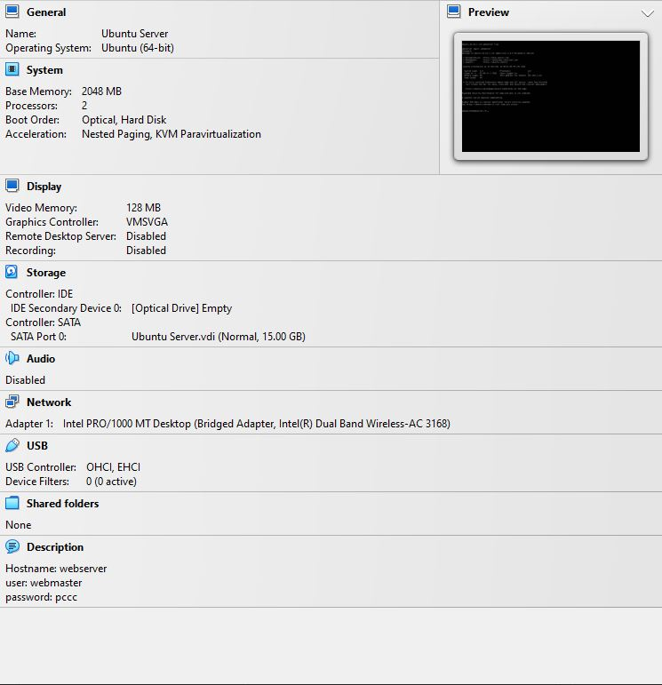
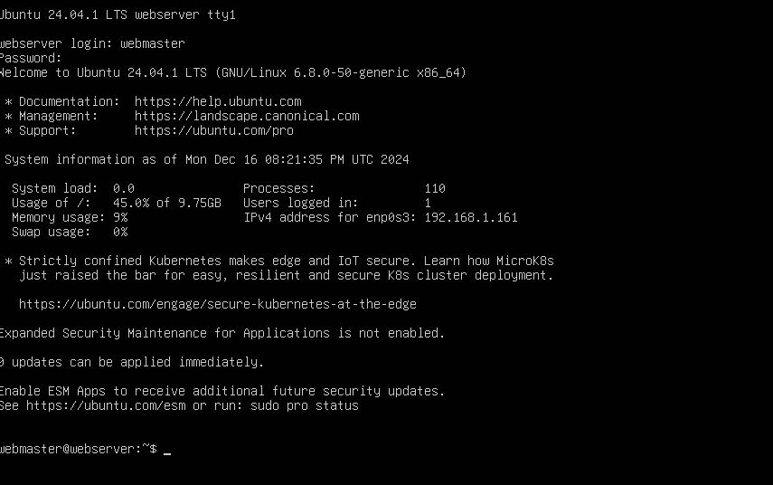
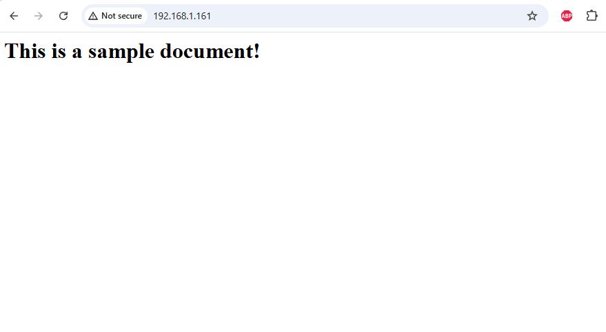

# Deliverable 2 Submission

## Server Specifications

## Ubuntu Login Screen

## Sample Page

## Questions

1. What is the IP address of your Ubuntu Server Virtual Machine?
   192.168.1.161

2. How do you enable the Ubuntu Firewall?
   `sudo ufw enable`

3. How do you check if the Ubuntu Firewall is running?
   `sudo ufw status`

4. How do you disable the Ubuntu Firewall?
   `sudo ufw disable`

5. How do you add Apache to the Firewall?
   `sudo ufw allow 'Apache'`

6. What is the command you used to install Apache?
   `sudo apt install apache2 -y`

7. What is the command you use to check if Apache is running?
   `systemctl status apache2 --no-pager`

8. What is the command you use to stop Apache?
   `sudo systemctl stop apache2 ssh`

9.  What is the command you use to restart Apache?
    `sudo systemctl restart apache2 ssh`

10. What is the command used to test Apache configuration?
    `sudo apache2ctl configtest`

11. What is the command used to check the installed version of Apache?
    `systemctl status apache2 --no-pager`

12. What are the most common commands to troubleshoot Apache errors? Provide a brief description of each command.
    `systemctl status apache2 --no-pager`
    * To check the status of Apache
    `sudo apache2ctl configtest`
    * Test the configuration for errors
    `sudo systemctl restart apache2 ssh`
    To restart the services if not active

13. Which are Apache Log Files, and what are they used for? Provide examples and screenshots.
    Used to create a log file and add text
    `sudo nano /etc/apache2/sites-available/mywebsite.conf`
    Example:
<VirtualHost *:80>
    ServerAdmin webmaster@localhost
    ServerName mywebsite
    ServerAlias www.mywebsite
    DocumentRoot /var/www/mywebsite
    ErrorLog {APACHE_LOG_DIR}/error.log
    CustomLog ${APACHE_LOG_DIR}/access.log combined
</VirtualHost>

    

