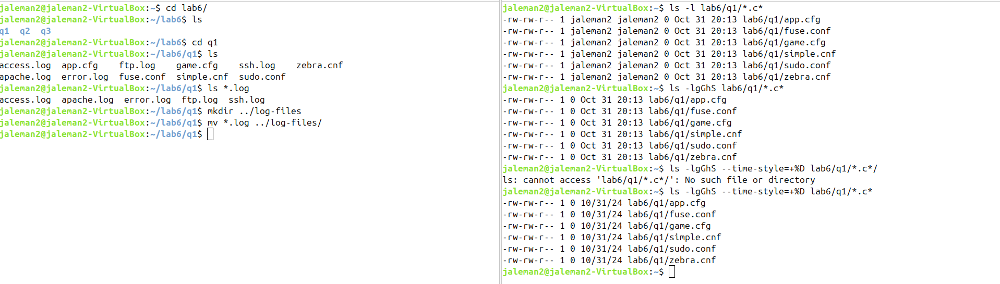
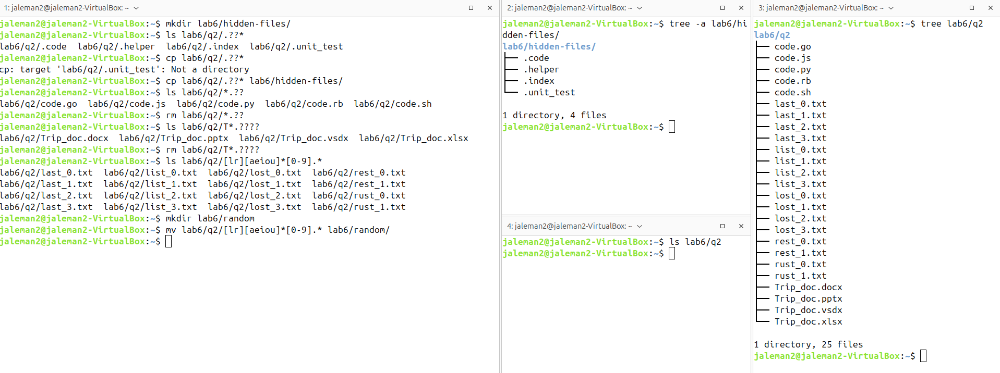
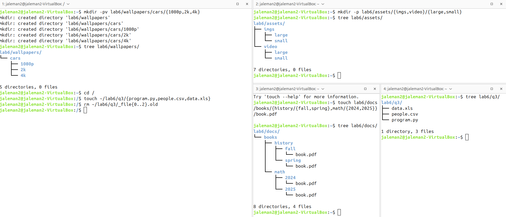
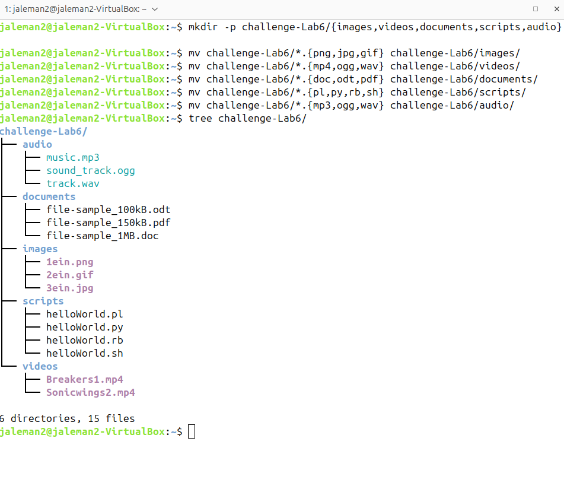

# Lab 6 Submission

## Question 1

## Question 2

## Question 3

## Challenge Question
**I accidentally made a mistake with moving a group of file types into a different folder, that is why you see the same file types in the a command twice**
